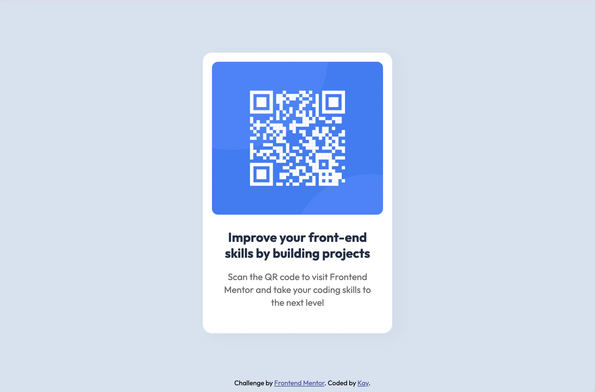

# Frontend Mentor - QR code component solution

This is a solution to the [QR code component challenge on Frontend Mentor](https://www.frontendmentor.io/challenges/qr-code-component-iux_sIO_H). Frontend Mentor challenges help you improve your coding skills by building realistic projects. 

## Table of contents

- [Overview](#overview)
  - [Screenshot](#screenshot)
- [My process](#my-process)
  - [Built with](#built-with)
  - [What I learned](#what-i-learned)
  - [Continued development](#continued-development)
  - [Useful resources](#useful-resources)
- [Author](#author)

## Overview

### Screenshot

## My process

### Built with

- Simple HTML markup
- SCSS

### What I learned

This was a great little project to get used to the workflow. I have used this as a starter project so I can get github set up and practice using SCSS in Visual Studio Code (I used to use Dreamweaver).

### Continued development

I'd love to continue doing some projects like these to learn advanced CSS, flexbox layouts, JS and to build on my existing development knowledge.

### Useful resources

- [Udemy Complete Web Development Bootcamp](https://www.udemy.com/course/the-complete-web-development-bootcamp/) - This udemy course is absolutely brilliant. Great for going back to the basics of HTML & CSS and building on my existing development skills. Looking forward to getting to the JS section as I have very little knowledge of JS.
- [MDN web docs](https://developer.mozilla.org/en-US/docs) - Invaluable as always! Great for referring to when code doesn't quite work the way it should.

## Author

- Website / WIP - [Kay](https://www.kaywyeth.co.uk)
- Frontend Mentor - [@kayy-w](https://www.frontendmentor.io/profile/kayy-w)
- Twitter - [@kaywyeth](https://www.twitter.com/kaywyeth)